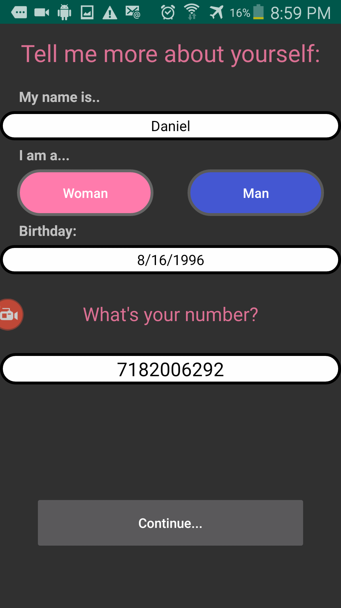
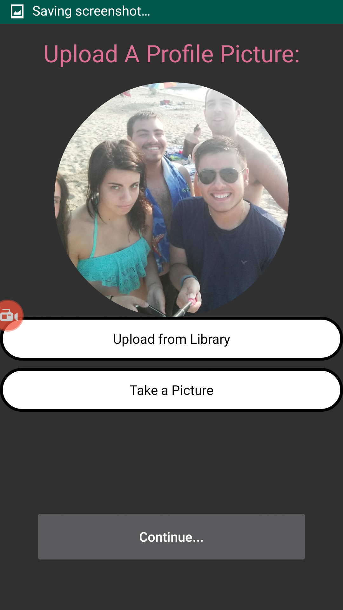
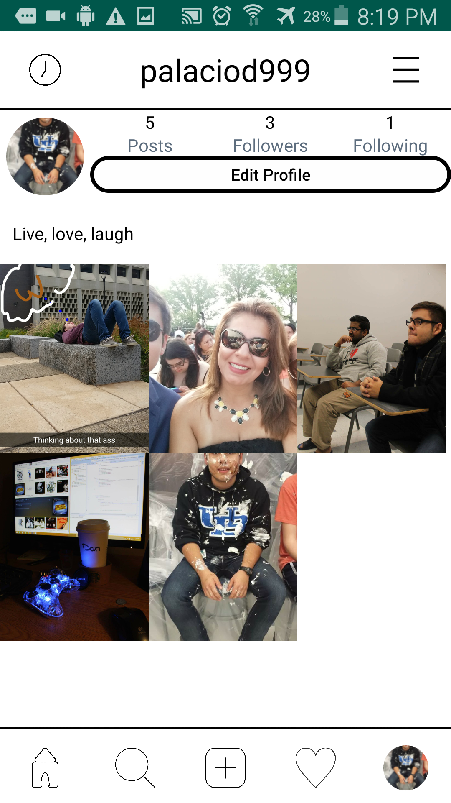

# Instagram
A copy of the famous social media android application. 

### Why did I build an already existing app? 

I wanted to familiarize myself with the Firebase real-time database and its storage.
I found it to be convenient and simple to understand with its detailed documentation. 
Of course it’s heavily advised to not use firebase as your entire backend, I just wanted to see if it was possible to build and entire social media
app with just firebase and I did.

## Technologies: 
1. Firebase Realtime Database, Firebase Storage, Firebase Authentication 
2. Recyclerview Library
3. Glide Image Library

## Languages: 
1. Java
2. XML

#### What can the app do?
1. The app can authenticate users
2. Allow those users to post images that it’s followers can see
3. A dedicated profile that includes a bio, follower count, following count, and post count
4. Users are allowed to like each other’s posts as well as comment. Those likes are also tracked and give the amount of likes per post.
5. Users can also follower other profiles that will show their posts in the user’s home feed.
6. Users can upload images from their image gallery store in external storage or can be uploaded via camera.

#### What I didn't include: 
1. A story board system.
2. A messaging system. (Still in the process)
3. When searching the a profile the user must input the complete correct username

#### Below are some screenshots of the app

    
    
 
    
    
    
 
